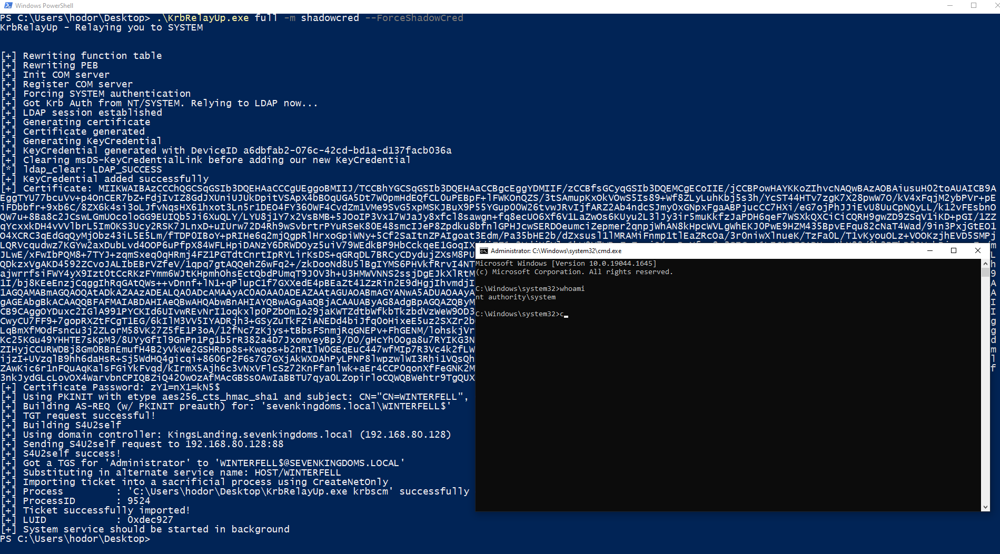

# KrbRelayUp
Simple wrapper around some of the features of [Rubeus](https://github.com/GhostPack/Rubeus/) and [KrbRelay](https://github.com/cube0x0/KrbRelay) (and a few other honorable mentions in the acknowledgements section) in order to streamline the abuse of the following attack primitive:

0. (Optional) New machine account creation ([New-MachineAccount](https://github.com/Kevin-Robertson/Powermad/blob/master/Powermad.ps1))
1. Local machine account auth coercion ([KrbRelay](https://github.com/cube0x0/KrbRelay))
2. Kerberos relay to LDAP ([KrbRelay](https://github.com/cube0x0/KrbRelay))
3. Add RBCD privs and obtain privileged ST to local machine ([Rubeus](https://github.com/GhostPack/Rubeus/))
4. Using said ST to authenticate to local Service Manager and create a new service as NT/SYSTEM. ([SCMUACBypass](https://gist.github.com/tyranid/c24cfd1bd141d14d4925043ee7e03c82))

**This is essentially a universal no-fix local privilege escalation in windows domain environments where LDAP signing is not enforced (the default settings).**

**UPDATE:** [Here](https://gist.github.com/tothi/bf6c59d6de5d0c9710f23dae5750c4b9) is an excellent writeup by [@an0n_r0](https://twitter.com/an0n_r0) on how to perform this attack manually (using the **original tools** for this attack path: [PowerMad](https://github.com/Kevin-Robertson/Powermad)/[SharpMad](https://github.com/Kevin-Robertson/Sharpmad), [KrbRelay](https://github.com/cube0x0/KrbRelay), [Rubeus](https://github.com/GhostPack/Rubeus) and [SCMUACBypass](https://gist.github.com/tyranid/c24cfd1bd141d14d4925043ee7e03c82))

### Update - Shadow Credentials Support
I added some features to support this attack primitive using shadow credentials. Note this eliminates the need for adding (or owning) another machine account.

1. Local machine account auth coercion ([KrbRelay](https://github.com/cube0x0/KrbRelay))
2. Kerberos relay to LDAP ([KrbRelay](https://github.com/cube0x0/KrbRelay))
3. Generate new KeyCredential and add it to the local machine account's 'msDS-KeyCredentialLink' attribute. ([Whisker](https://github.com/eladshamir/Whisker) and [KrbRelay](https://github.com/cube0x0/KrbRelay))
4. Using said KeyCredential to obtain a TGT for the local machine account via PKInit. ([Rubeus](https://github.com/GhostPack/Rubeus/))
5. Using the TGT to obtain privileged ST to local machine via S4U2Self and TGSSUB. ([Rubeus](https://github.com/GhostPack/Rubeus/))
6. Using said ST to authenticate to local Service Manager and create a new service as NT/SYSTEM. ([SCMUACBypass](https://gist.github.com/tyranid/c24cfd1bd141d14d4925043ee7e03c82))

## Usage
```
KrbRelayUp - Relaying you to SYSTEM

FULL: Perform full attack chain. Options are identical to RELAY. Tool must be on disk.
RELAY: First phase of the attack. Will Coerce Kerberos auth from local machine account, relay it to LDAP and create a control primitive over the local machine using RBCD or SHADOWCRED.
Usage: KrbRelayUp.exe relay -d FQDN -cn COMPUTERNAME [-c] [-cp PASSWORD | -ch NTHASH]

    -m   (--Method)                   Abuse method to use in after a successful relay to LDAP <rbcd/shadowcred> (default=rbcd)
    -p   (--Port)                     Port for Com Server (default=12345)

    # RBCD Method:
    -c   (--CreateNewComputerAccount) Create new computer account for RBCD. Will use the current authenticated user.
    -cn  (--ComputerName)             Name of attacker owned computer account for RBCD. (default=KRBRELAYUP$)
    -cp  (--ComputerPassword)         Password of computer account for RBCD. (default=RANDOM [if -c is enabled])

    # SHADOWCRED Method:
    -f   (--ForceShadowCred)          Clear the msDS-KeyCredentialLink attribute of the attacked computer account before adding our new shadow credentials. (Optional)


SPAWN: Second phase of the attack. Will use the appropriate control primitive to obtain a Kerberos Service Ticket and will use it to create a new service running as SYSTEM.
Usage: KrbRelayUp.exe spawn -d FQDN -cn COMPUTERNAME [-cp PASSWORD | -ch NTHASH] <-i USERTOIMPERSONATE>

    -m   (--Method)                   Abuse method used in RELAY phase <rbcd/shadowcred> (default=rbcd)
    -i   (--Impersonate)              User to impersonate. should be a local administrator in the target computer. (default=Administrator)
    -s   (--ServiceName)              Name of the service to be created. (default=KrbSCM)
    -sc  (--ServiceCommand)           Service command [binPath]. (default = spawn cmd.exe as SYSTEM)

    # RBCD Method:
    -cn  (--ComputerName)             Name of attacker owned computer account for RBCD. (default=KRBRELAYUP$)
    -cp  (--ComputerPassword)         Password of computer account for RBCD. (either -cp or -ch must be specified)
    -ch  (--ComputerPasswordHash)     Password NT hash of computer account for RBCD. (either -cp or -ch must be specified)

    # SHADOWCRED Method:
    -ce  (--Certificate)              Base64 encoded certificate or path to certificate file
    -cep (--CertificatePassword)      Certificate password (if applicable)


General Options:
    -d  (--Domain)                   FQDN of domain. (Optional)
    -dc (--DomainController)         FQDN of domain controller. (Optional)
    -ssl                             Use LDAP over SSL. (Optional)
    -n                               Use CreateNetOnly (needs to be on disk) instead of PTT when importing ST (enabled if using FULL mode)


KRBSCM: Will use the currently loaded Kerberos Service Ticket to create a new service running as SYSTEM.
Usage: KrbRelayUp.exe krbscm <-s SERVICENAME> <-sc SERVICECOMMANDLINE>

    -s  (--ServiceName)              Name of the service to be created. (default=KrbSCM)
    -sc (--ServiceCommand)           Service command [binPath]. (default = spawn cmd.exe as SYSTEM)
```

## Examples




## TODO
- [x] Code refactoring and cleanup!!!
- [x] Add ShadowCred attack as a RELAY method
- [ ] Add TGTDELEG attack  in SPAWN method to be used in Network Service->SYSTEM scenarios (potatoes alternative)
- [x] Fix the issue I'm having trying to combine the RELAY and SPAWN methods into one run so it can be used as one complete command. Probably has something to do with the fact that both RELAY and SPAWN functionalities rely on hooks during the initialization of the COM Server (Once RELAY initializes its COM Server the SPAWN can't re-initialize it to place its hooks as well)

## Mitigation & Detection
* Enforce LDAP Signing and LDAP Channel Binding to mitigate the relay of the machine account KRB auth to LDAP. This can be configured via the "Domain Controller: LDAP server signing requirements" GPO. (Thank you [Will Dormann](https://twitter.com/wdormann) for your [tweet](https://twitter.com/wdormann/status/1518999885550440451) on this matter)
* Make the attack requirements harder to obtain by setting the [MS-DS-Machine-Account-Quota attribute](https://docs.microsoft.com/en-us/windows/win32/adschema/a-ms-ds-machineaccountquota) in AD to **0**, thus removing the ability of any user to add a new machine account to the domain. This is a dangerous default setting in AD - make sure you change it.
* Setting the flag "Account is sensitive and cannot be delegated" on all admin accounts (or put them in protected users) would make it so there is no account with the privileges required that can be delegated in order to complete the attack path. (Thanks to [Christoph Falta](https://twitter.com/cfalta) for this [tweet](https://twitter.com/cfalta/status/1519309206230339585))
* Resources for possible monitoring and detection rules:
    1. https://github.com/tsale/Sigma_rules/blob/main/windows_exploitation/KrbRelayUp.yml ([@Kostastsale](https://twitter.com/Kostastsale))
    2. https://twitter.com/SBousseaden/status/1518976397364056071 ([@SBousseaden](https://twitter.com/SBousseaden)). Mainly the rule about authentication to Service Manager via Kerberos from 127.0.0.1, Great Work!.
    3. https://www.linkedin.com/posts/john-dwyer-xforce_threathunting-threatdetection-blueteam-activity-6924739962131140608-py45/ ([John Dwyer](https://www.linkedin.com/in/john-dwyer-xforce/) [@TactiKoolSec](https://twitter.com/TactiKoolSec))
    4. https://twitter.com/cyb3rops/status/1519241598311321601 ([@cyb3rops](https://twitter.com/cyb3rops))


## Acknowledgements
* [James Forshaw](https://twitter.com/tiraniddo) for his research on [Kerberos relaying](https://googleprojectzero.blogspot.com/2021/10/using-kerberos-for-authentication-relay.html) and for figuring out how to [use Kerberos Service Tickets for LOCAL authentication to Service Manager](https://gist.github.com/tyranid/c24cfd1bd141d14d4925043ee7e03c82) which was the missing piece of the puzzle in order to make this attack primitive **local only** (before that, we had to export the ST to a remote machine in order to use it and gain privileged access to our target machine). Also for his [New-MachineAccount](https://github.com/Kevin-Robertson/Powermad/blob/master/Powermad.ps1) functionality which was used in this project.
* [Cube0x0](https://twitter.com/cube0x0) This project wouldn't exist without his amazing work on [KrbRelay](https://github.com/cube0x0/KrbRelay) - a lot of code was taken from there and it made me gain a deeper understanding on how Kerberos Relaying works (I really recommend going through the code for anyone who wish to understand the concept better).
* [Elad Shamir](https://twitter.com/elad_shamir) for his research on [Shadow Credentials](https://posts.specterops.io/shadow-credentials-abusing-key-trust-account-mapping-for-takeover-8ee1a53566ab) and his awsome tool [Whisker](https://github.com/eladshamir/Whisker) - parts of his code (and of course [cube0x0](https://twitter.com/cube0x0)'s [KrbRelay](https://github.com/cube0x0/KrbRelay) code) was used to add support for the Shadow Credentials attack in this tool.
* [Will Schroeder](https://twitter.com/harmj0y) and everyone who contributed to [Rubeus](https://github.com/GhostPack/Rubeus/) which we all know and love. Basically all the RBCD-S4U functionality was taken from there.
* [Michael Grafnetter](https://twitter.com/mgrafnetter) for his tool [DSInternals](https://github.com/MichaelGrafnetter/DSInternals) which was used here to help with the Shadow Credentials functionality.
* [Orange-Cyberdefense](https://github.com/Orange-Cyberdefense) for their work on [GOAD](https://github.com/Orange-Cyberdefense/GOAD), the Active Directory research lab I am using which you can see in the demo video and images.
